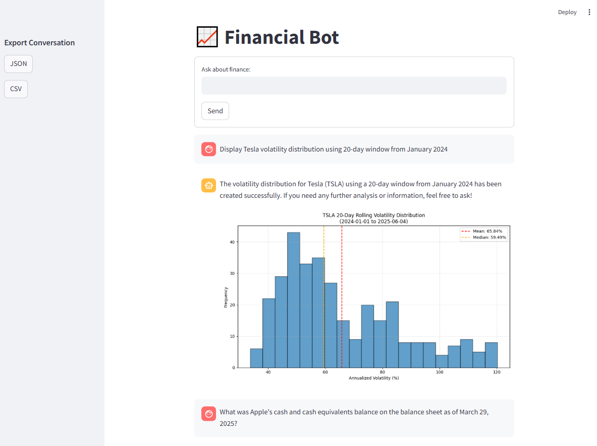
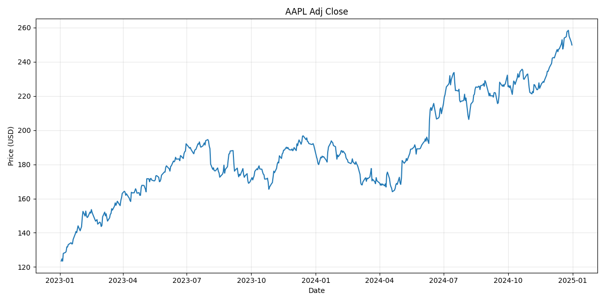
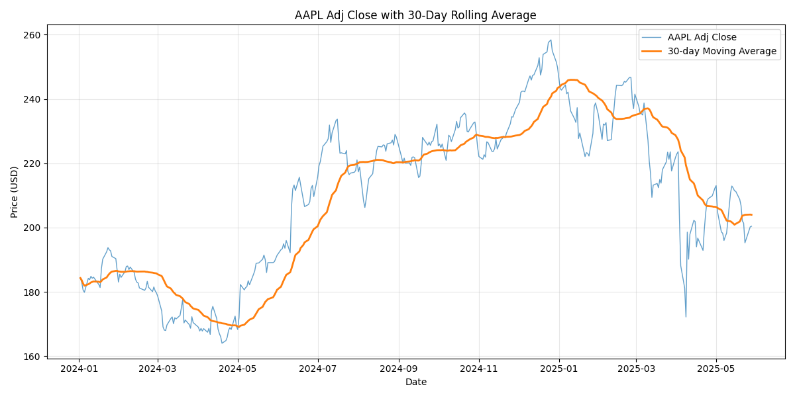
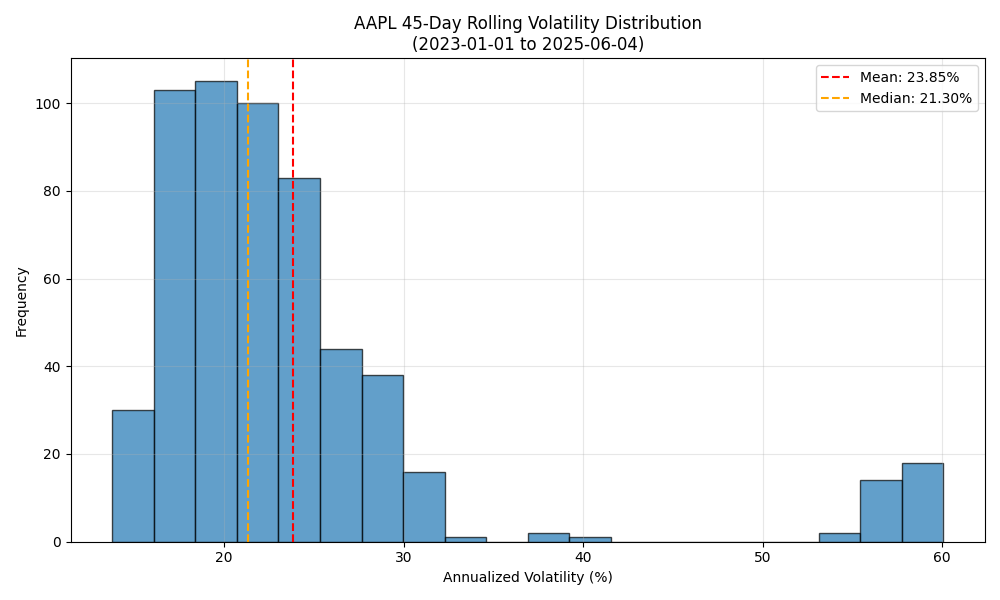

# Financial Advisor Bot

A LangChain-powered chatbot that provides financial analysis, stock visualization, and document search through advanced RAG (Retrieval Augmented Generation) capabilities.

## What This App Does

✅ **Financial Chart Generation**: Creates price charts, moving averages, and volatility histograms from S&P 500 data from 2020 till 05-28-2025
✅ **Document Search**: RAG-powered search through Apple financial statements  
✅ **Natural Language Queries**: Ask complex financial questions in plain English  
✅ **Function Calling**: AI automatically selects appropriate tools based on user intent  
✅ **Conversation Export**: Download chat history in JSON/CSV formats  
✅ **Historical Data Analysis**: Generate insights from historical market data

## What This App Does NOT Do

❌ **Real-time Stock Prices**: Uses historical data only, not live market feeds  
❌ **Investment Advice**: Provides analysis tools, not personalized financial recommendations  
❌ **Trading Execution**: Cannot place orders or connect to brokerages  
❌ **All Companies**: Limited to S&P 500 chart data and Only 2025 Apple financial documents  
❌ **Future Predictions**: Shows historical trends, doesn't forecast prices  
❌ **Portfolio Management**: No account tracking or position monitoring

**⚠️ Educational Use Only**: This application is designed for learning and demonstration purposes. Not intended for actual investment decisions.

---

## Description

This is a specialized **Financial Advisor Bot** built with **Streamlit**, **LangChain**, and **OpenAI's GPT models**. The application demonstrates advanced AI agent implementation with function calling capabilities and RAG document search, allowing users to request stock analysis, generate charts, and search financial documents through natural language queries.



---

## Features Implemented

### Core Requirements

- [x] Streamlit-based chat interface with conversation export
- [x] LangChain agent with OpenAI integration
- [x] Advanced function calling implementation (4+ tools)
- [x] **RAG Implementation** with financial document search
- [x] Domain-specific financial specialization
- [x] Local S&P 500 dataset processing
- [x] Session-persistent chat history

### Function Calling Tools

#### 1. plot_price_from_local_data

Generates basic stock price charts from historical CSV data.

- **Purpose**: Visualize stock price movements over time
- **Example**: "Plot Apple stock from January 2023 to December 2024"
- **Output**: 
- **Core logic**:

```python
series = df[(field, ticker)].dropna()
plt.plot(series.index, series.values)
plt.savefig(f"data/{ticker}_{timestamp}.png")
```

#### 2. plot_rolling_average

Creates stock charts with moving average overlay for trend identification.

- **Purpose**: Smooth price volatility to identify trends
- **Example**: "Show AAPL with 30-day moving average from 2024"
- **Output**: 
- **Core logic**:

```python
series = df[(field, ticker)].dropna()
rolling_avg = series.rolling(window=window).mean()
plt.plot(series.index, series.values, label='Price')
plt.plot(rolling_avg.index, rolling_avg.values, label='MA')
```

#### 3. plot_volatility_histogram

Analyzes risk patterns through volatility distribution visualization.

- **Purpose**: Understand stock risk characteristics and frequency
- **Example**: "Display Apple volatility histogram using 45-day window from 2023"
- **Output**: 
- **Core logic**:

```python
returns = series.pct_change().dropna()
volatility = returns.rolling(window=window).std() * (252**0.5)
plt.hist(volatility.values, bins=20)
plt.axvline(volatility.mean(), color='red', label='Mean')
```

#### 4. search_financial_documents

**NEW**: RAG-powered financial document search using ChromaDB.

- **Purpose**: Search and retrieve information from financial statements
- **Example**: "What was Apple's research and development expense line item in the operating expenses section for Q2 2025?"
- **Core logic**:

```python
results = vector_store.similarity_search(query, k=max_results)
# Returns relevant document chunks with metadata
```

### Technical Features

- Unique timestamp-based file naming
- Message-specific plot tracking (prevents plot mixing)
- Error handling and data validation
- Chronological message ordering with newest conversations first
- **RAG Implementation** with ChromaDB vector store
- **Conversation export** functionality (JSON/CSV)
- Advanced chunking strategies for financial documents

---

## Working Prompts

### Chart Generation

- "Plot Apple stock from 2024"
- "Show AAPL with 50-day moving average from 2023 to now"
- "Display Tesla volatility distribution using 20-day window from January 2024"

### Financial Document Search (RAG)

- "What was Apple's research and development expense line item in the operating expenses section for Q2 2025?"
- "What was Apple's total net sales figure for the Americas region in Q1 2025?"
- "What was Apple's cash and cash equivalents balance on the balance sheet as of March 29, 2025?"
- "What was Apple's net income line item in the condensed consolidated statements of operations for Q1 2025?"

### Comparison Queries

- "Compare iPhone sales Q1 2025 vs Q2 2025"
- "What are Apple's total assets in latest quarter?"

---

## Installation

```bash
git clone <repository-url>
cd financial-advisor-bot
pip install streamlit langchain-community langchain-openai pypdf chromadb pandas matplotlib yfinance python-dotenv sentence-transformers
```

## Configuration

Create `.env` file:

```
OPENAI_API_KEY=your_openai_api_key_here
```

## Usage

```bash
streamlit run app/main.py
```

**Note**: Add your financial documents (PDFs) to `data/financial_docs/` folder for RAG functionality.

---

## Project Structure

```
├── app/
│   └── main.py               # Main Streamlit application
├── tools/
│   └── finance_tools.py      # Financial analysis functions
├── agents/
│   └── chat_agent.py         # LangChain agent implementation
├── rag/                      # RAG implementation
│   ├── __init__.py
│   ├── document_loader.py    # PDF processing and chunking
│   ├── vector_store.py       # ChromaDB vector store management
│   └── rag_tool.py           # RAG search tool
├── data/
│   ├── hist_prices.csv       # S&P 500 historical data
│   ├── financial_docs/       # Financial PDFs (add your own)
│   ├── chroma_db/           # Vector database (auto-generated)
│   └── *.png                # Generated chart files
└── .env                     # Environment variables
```

---

## RAG Implementation Details

### Document Processing

```python
# Recursive text splitting with financial document optimization
text_splitter = RecursiveCharacterTextSplitter(
    chunk_size=1000,
    chunk_overlap=500,
    separators=["\n\n", "\n", " ", ""]
)
```

### Vector Store

- **ChromaDB** for efficient similarity search
- **OpenAI embeddings** for semantic understanding
- **Metadata tracking** for quarter/year filtering

### Search Optimization

- Precise financial terminology required
- Section-specific queries work best
- Enhanced metadata for accurate retrieval

---

## Built For

**Turing College Sprint 2**: Building Applications with LangChain, RAGs, and Streamlit

**Technologies**: Python, Streamlit, LangChain, OpenAI, ChromaDB, Pandas, Matplotlib
